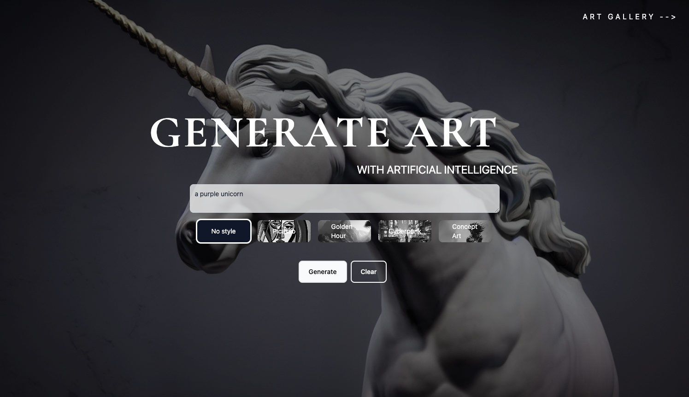

# Boid Art

This is a text2img demonstration originally created as an experience for the "StartUps and Boids" event in Munich. It let's users create AI powered art by inputting prompts while also providing a foto wall of all images created throughout the event in real time.

This project utilized [Stable-Diffusion on Replicate](https://replicate.com/stability-ai/stable-diffusion) to generate images.

Find it on [boid-art.vercel.app](https://boid-art.vercel.app/)

Made possible by AVA Boids from [Netlight](http://netlight.com/).



## Past Events

The app collects images into "Events". You are only able to generate image when an event is running. Here is a list of past events and where to find their generated images:

- [StartUps and Boids](https://boid-art.vercel.app/results/StartUpAndBoids)

## Development

### Config

First, you need to configure a `.env.local` with all required variables. You can copy `.env.example` to get started.

- **REPLICATE_TOKEN** is your API token for replicate to call their stable-diffusion API.
- **SERVICE_ACCOUNT** service account JSON for Firebase.
- **DEV_EVENT_ID** to use a specific event for development. This will overwrite event configuration locally.

### Local

Run the development server:

```bash
npm run dev
```

Open [http://localhost:3000](http://localhost:3000) with your browser to see the result.

## Under the hood

### Techstack

- NextJS 13
- Tailwind
- Vercel
- Firebase
- Replicate
- Tap
